# loop_agent 大迭代方案（Plan-Replan + Tool Use）

## 1. 背景与目标

当前自然语言流程是“单次意图识别 -> 直接执行”，在多目标任务、信息不完整任务、需要联网补充信息的任务上可扩展性不足。

本次 `loop_agent` 迭代目标：

1. 将自然语言流程升级为 **plan -> act -> observe -> replan** 的循环代理。
2. 支持模型判断是否调用工具，并可多轮重规划直到完成目标。
3. 支持在信息不足时向用户澄清（ask_user）。
4. 保持 slash 命令直通（不回归、不破坏现有 CLI 使用方式）。

---

## 2. 已确认决策（需求冻结）

### 2.1 你已确认的 8 项

1. ask_user 一次只问 1 个问题（A）
2. 澄清轮次不限（B）
3. 每轮只允许 1 个工具动作（A）
4. internet_search 由代理自主决定是否触发（B）
5. 搜索返回 Top-3 摘要 + 来源链接（A）
6. done 必须是“目标完成 + 最终可执行结果”（A）
7. 达上限时输出“已完成部分 + 未完成原因 + 下一步建议”（A）
8. slash 命令继续走原路径，不进入 planner（A）

### 2.2 补充 4 项

1. `max_steps = 20`（用于当前极端场景测试）
2. ask_user 文案前缀固定为：`请确认：...`
3. internet_search 先做简单实现（无额外依赖）
4. 澄清会话状态仅进程内保存（重启后丢失）

---

## 3. 输入路由与兼容策略

### 3.1 路由规则

- 输入以 `/` 开头：继续走 `_handle_command` 现有逻辑。
- 非 `/` 输入：进入 plan-replan 循环。

### 3.2 兼容目标

- `/todo`、`/schedule`、`/view` 现有行为不变。
- 原有意图识别逻辑短期作为 fallback（避免一次性删除造成回归）。

---

## 4. 循环状态机设计

### 4.1 主循环

对于非 slash 输入：

1. 初始化上下文（goal、observations、step_count、history）
2. 调用 planner 生成本轮 JSON（含 plan + next_action）
3. 若 status=done：输出 response，结束
4. 若 status=continue：执行一个工具动作
5. 记录 observation
6. 回到第 2 步重规划
7. 若达到 `max_steps=20`：进入兜底输出并结束

### 4.2 计步规则

- `todo` / `schedule` / `internet_search` 会消耗 step。
- `ask_user` 不消耗 step（因为澄清轮次不限）。

### 4.3 终止条件

任一满足即终止：

- planner 明确 `status=done` 且提供最终响应
- 达到 `max_steps=20`
- planner JSON 连续多次不合法（触发故障兜底）

### 4.4 Planner 重试策略

- 每轮 planner 解析失败可重试 2 次（总计最多 3 次）。
- 3 次都失败则记一次“planner 失败 observation”，交给 replan 或直接触发兜底。
- 若连续多轮都是 planner 失败（例如 2 轮），直接进入兜底，避免空转。

---

## 5. Planner 协议（LLM 输出契约）

每轮 planner 只允许输出一个 JSON 对象：

```json
{
  "status": "continue|done",
  "plan": ["步骤1", "步骤2"],
  "next_action": {
    "tool": "todo|schedule|internet_search|ask_user",
    "input": "string"
  },
  "response": "string|null"
}
```

校验规则：

1. `status=continue`：必须有 `next_action`，`response` 为空
2. `status=done`：`next_action` 必须为 `null`，`response` 必须非空
3. `tool` 仅允许四种：`todo`、`schedule`、`internet_search`、`ask_user`
4. 任一字段不合法 -> 本轮视为 planner 失败，进入重试或兜底

---

## 6. 工具契约

### 6.1 todo 工具

- 输入：完整命令字符串
- 限制：必须以 `/todo` 或 `/view` 开头
- 执行：复用 `_handle_command`
- observation：命令 + 结果摘要（成功/失败）

### 6.2 schedule 工具

- 输入：完整命令字符串
- 限制：必须以 `/schedule` 开头
- 执行：复用 `_handle_command`
- observation：命令 + 结果摘要（成功/失败）

### 6.3 internet_search 工具（简单实现）

- 输入：自然语言查询词
- 实现：标准库 `urllib` 发起 HTTP 请求，不引入第三方依赖
- 首版来源：使用 Bing（query -> HTML），通过轻量规则抽取前 3 条结果
- 输出：Top-3 结果，每条包含标题/摘要/链接
- 异常：网络失败或解析失败返回结构化错误 observation，不中断主循环

### 6.4 搜索源解耦约束

- 设计 `SearchProvider` 抽象接口（例如 `search(query: str, top_k: int) -> list[SearchResult]`）。
- `internet_search` 工具只依赖接口，不直接绑定具体搜索源实现。
- 首版默认注入 `BingSearchProvider`；后续可替换为其他 provider（DuckDuckGo/SerpAPI/企业内检索）而不改 agent 主循环。
- provider 内部负责：
  1) 请求构建与超时控制  
  2) 响应解析与结果标准化  
  3) 错误映射（网络错误、解析错误、空结果）

### 6.5 ask_user 工具

- 输入：本轮要向用户澄清的单个问题
- 输出：固定前缀文案：`请确认：{问题}`
- 机制：返回后暂停本轮任务，等待用户下一条输入作为澄清答案

---

## 7. Observe 设计

统一 observation 结构（文本化写入 planner 上下文）：

- `tool`: 工具名
- `input`: 工具输入
- `ok`: true/false
- `result`: 关键结果（自动截断）

约束：

- 每条 observation 长度限制为 10000 字符
- 只保留最近 100 条 observation（防止上下文失控）
- 长输出做摘要化，不把整表全量塞回 planner

---

## 8. ask_user 会话态（进程内）

在 `AssistantAgent` 进程内维护 pending 状态：

- `active`: 是否处于澄清中
- `goal`: 原始用户目标
- `clarification_history`: 澄清问答历史
- `observations`: 工具观察历史
- `step_count`: 当前已消耗 step
- `latest_plan`: 最近一轮计划

行为：

1. ask_user 触发后保存 pending 状态并返回问题。
2. 用户下一条自然语言输入先喂给 pending 任务（而不是新开任务）。
3. 当任务 done/失败兜底时清理 pending 状态。
4. 用户输入 slash 命令时不影响 pending 状态（执行命令后仍可继续澄清任务）。
5. 用户输入“取消当前任务”时立即清理 pending 状态，并返回“已取消当前任务。”。

---

## 9. 失败兜底策略

### 9.1 达到 max_steps=20

输出结构：

1. 已完成部分
2. 未完成原因
3. 下一步建议（建议用户补充信息或改用明确命令）

### 9.2 planner 不可用

- 连续重试失败后，返回稳定错误提示
- 文案应引导用户使用 `/todo`、`/schedule` 命令继续操作

### 9.3 工具失败

- 工具失败不直接终止循环，先作为 observation 反馈给 planner 重规划
- 只有在达到上限或 planner 反复无效时结束

---

## 10. 测试计划（必须落地）

### 10.1 新增测试

1. 多轮工具链路：todo + schedule 组合完成一个复合目标
2. replan 成功：首轮动作失败，次轮修正并完成
3. ask_user 链路：连续多轮澄清后完成
4. internet_search 链路：返回 Top-3 摘要+链接
5. max_steps 兜底：20 步后正确输出总结
6. planner 非法 JSON：重试与兜底逻辑

### 10.2 回归测试

1. `/todo` 全部现有命令行为不变
2. `/schedule` 全部现有命令行为不变
3. `/view` 行为不变
4. chat path 在无工具场景可正常回复

---

## 11. 实施顺序（小步可验证）

1. 定义 planner/工具/observation 数据结构与校验函数
2. 在 `AssistantAgent` 接入主循环（不动 slash 分支）
3. 接入 `todo` 与 `schedule` 工具
4. 接入 `ask_user` + pending 会话态
5. 接入 `internet_search` 简单实现
6. 完整补测并回归
7. 更新 README 与迭代报告

---

## 12. 风险与控制

1. **LLM 输出不稳定** -> 严格 JSON 校验 + 重试 + 兜底
2. **上下文膨胀** -> observation 截断 + 仅保留最近记录
3. **循环失控** -> `max_steps=20` 硬限制
4. **网络波动** -> internet_search 失败结构化回传，不阻断
5. **行为回归** -> slash 路径隔离 + 回归测试兜底

---

## 13. Definition of Done（本迭代）

1. 非 slash 输入默认走 plan-replan 循环
2. 四个工具可用：todo/schedule/internet_search/ask_user
3. ask_user 支持无限轮澄清（进程内）
4. 达到 20 步可正确兜底
5. 现有 slash 命令与核心测试不回归
6. README 与 doc 文档同步更新

---

## 14. 完整时序图（当前实现：plan -> thought -> act -> observe -> replan）

> 说明：以下时序图对齐当前实现口径：  
> 1) `plan` 仅在任务首次输入时触发；  
> 2) `replan` 在每个子任务的 thought->act->observe 循环完成后触发（用户澄清恢复后同样触发）；  
> 3) `thought/replan/tool` 都计步，`plan_once` 与 `ask_user` 等待不计步；  
> 4) 每轮循环开头先检查步数上限。

```mermaid
sequenceDiagram
    autonumber
    participant U as 用户
    participant A as AssistantAgent
    participant P as PendingPlanTask(状态)
    participant L as LLM
    participant T as Tool(todo/schedule/search)

    U->>A: handle_input(text)

    alt text == TASK_CANCEL_COMMAND
        A->>A: 若有 pending_task 则清空
        A-->>U: 已取消当前任务 / 当前没有进行中的任务
    else text 以 "/" 开头
        A->>A: 执行确定性命令路径 _handle_command()
        Note over A,P: pending_task 不会被清空（若存在）
        A-->>U: slash 命令执行结果
    else 非 slash 自然语言
        alt 未配置 LLM
            A-->>U: 当前未配置 LLM
        else 存在 pending_task(用户在回答澄清)
            A->>P: clarification_history += 用户补充
            A->>P: awaiting_clarification=false
            A->>P: needs_replan=true
            A->>A: _run_outer_plan_loop(task=pending_task)
        else 新任务
            A->>P: 创建 task(goal=text)
            A->>A: _run_outer_plan_loop(task=new_task)
        end

        loop while True（主循环）
            A->>P: 检查 step_count >= max_steps ?
            alt 达到上限
                A->>A: 生成 step-limit fallback
                A-->>U: 已达到最大执行步数 + 已完成部分 + 未完成原因 + 下一步建议
            else 未超限
                A->>A: 输出进度日志（步骤进度）

                opt plan 尚未初始化（仅首次）
                    A->>L: 请求 PLAN payload (phase=plan)
                    loop 请求重试(最多 1+retry_count 次)
                        L-->>A: JSON
                        A->>A: parse + normalize_plan_decision(status=planned)
                    end
                    alt plan 失败（含解析/字段校验失败）
                        A-->>U: 计划执行服务暂时不可用
                    else plan 成功
                        A->>P: latest_plan=plan_items
                        A->>P: current_plan_index=0
                        A->>P: plan_initialized=true
                        A->>A: 输出“规划完成/计划列表”
                    end
                end

                alt awaiting_clarification == true
                    A->>A: 保存 pending_task
                    A-->>U: 请确认：请补充必要信息
                else 继续
                    opt needs_replan == true（每个子任务内层完成后/澄清恢复后）
                        A->>P: step_count += 1（replan 计步）
                        A->>L: 请求 REPLAN payload (phase=replan)
                        loop 请求重试(最多 1+retry_count 次)
                            L-->>A: JSON
                            A->>A: parse + normalize_replan_decision(status=replanned)
                        end
                        alt replan 失败（含解析/字段校验失败）
                            A->>P: planner_failure_rounds += 1
                            A->>P: observation += replan失败
                            alt 连续失败达到阈值
                                A-->>U: 计划执行服务暂时不可用
                            else 未到阈值
                                A->>A: 输出“重规划失败，准备重试”
                                Note over A,P: 回到 while 开头
                            end
                        else replan 成功
                            A->>P: latest_plan=新计划
                            A->>P: current_plan_index=0
                            A->>P: needs_replan=false
                            A->>P: planner_failure_rounds=0
                            A->>A: 输出“重规划完成/计划列表”
                        end
                    end

                    A->>A: 输出当前计划项 i/N
                    A->>P: step_count += 1（thought 计步）
                    A->>L: 请求 THOUGHT payload (phase=thought)
                    loop 请求重试(最多 1+retry_count 次)
                        L-->>A: JSON
                        A->>A: parse + normalize_thought_decision
                    end

                    alt thought 失败（含解析/字段校验失败）
                        A->>P: planner_failure_rounds += 1
                        A->>P: observation += thought失败
                        alt 连续失败达到阈值
                            A-->>U: 计划执行服务暂时不可用
                        else 未到阈值
                            A->>A: 输出“思考失败，准备重试”
                            Note over A,P: 回到 while 开头
                        end
                    else thought 成功
                        A->>P: planner_failure_rounds=0
                        A->>A: 根据 status 分支

                        alt status == done
                            A->>P: current_plan_index = min(index+1, len(plan))
                            A->>P: 若有 response 则写入 pending_final_response
                            A->>P: needs_replan=true
                            Note over A,P: 跳出内层，交给外层 replan 决策是否收口
                        else status == ask_user
                            alt question 缺失
                                A->>P: observation += ask_user缺字段
                                Note over A,P: 回到 while 开头
                            else 重复提问且用户已补充
                                A->>P: ask_user_repeat_count += 1
                                A->>P: observation += 重复提问
                                alt 重复达到阈值
                                    A-->>U: 无法完成重规划，请直接用 /todo 或 /schedule
                                else 未到阈值
                                    Note over A,P: 回到 while 开头
                                end
                            else 澄清轮次过多
                                A-->>U: 澄清次数过多，请直接用 /todo 或 /schedule
                            else 合法 ask_user
                                A->>P: clarification_history += 助手提问
                                A->>P: awaiting_clarification=true
                                A->>P: 记录 last_ask_user_question
                                A->>A: 保存 pending_task
                                A-->>U: 请确认：{question}
                            end
                        else status == continue（执行动作）
                            alt next_action 无效
                                A->>P: observation += next_action无效
                                Note over A,P: 回到 while 开头
                            else next_action 有效
                                A->>P: step_count += 1（tool 执行计步）
                                A->>T: 执行 tool(input)
                                T-->>A: result(ok/failed)
                                A->>P: 追加 observation（截断后）
                                A->>P: successful_steps/failed_steps 更新
                                A->>A: 输出动作结果与完成情况
                                Note over A,P: 回到 while 开头
                            end
                        end
                    end
                end
            end
        end
    end
```


